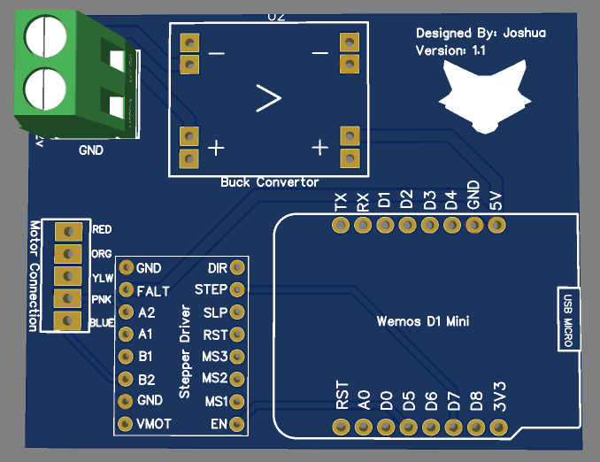

# Motorized MQTT Blinds

## ⚠️ This project is archived in favor of using ESPHome

### 🛠️ Migration to ESPHome (Recommended)

> **Notice**: This project is officially archived. I have migrated my entire fleet to ESPHome for better stability, native Home Assistant integration, and easier maintenance.

If you wish to follow this path, I recommend using a modular package structure to keep your configuration clean.

⚠️ MQTT Removed - Since this project was based on MQTT blinds, I feel I need to point out that I removed MQTT in my setup for this since I just tie into Home Assistant. It can easily be added back if you follow the [ESPHome documentation](https://esphome.io/).

### 1. The Global Packages

Create a `packages` folder in your ESPHome directory and add the following files to handle shared logic.

#### A. Network & API (`packages/common_wifi.yaml`)

```yaml
# packages/common_wifi.yaml
wifi:
  ssid: "YOUR_SSID"
  password: "YOUR_PASSWORD"
  min_auth_mode: WPA2
  fast_connect: true

time:
  - platform: homeassistant
    id: home_time

api:
  port: 6053
  reboot_timeout: 15min

ota:
  - platform: esphome
```

Handles WiFi, Home Assistant API, and OTA updates.

*B. The Diagnostic HUD (`packages/base_diagnostics.yaml`)*

Provides a unified set of health sensors for every device.

```yaml
# packages/base_diagnostics.yaml
logger:
  level: DEBUG

esphome:
  on_boot:
    priority: -10 
    then:
      - text_sensor.template.publish:
          id: esphome_version_sensor
          state: !lambda 'return ESPHOME_VERSION;'

sensor:
  - platform: uptime
    name: "Uptime"
    id: uptime_sensor
    type: timestamp
    entity_category: diagnostic

  - platform: wifi_signal
    name: "WiFi Signal"
    update_interval: 60s
    entity_category: diagnostic

text_sensor:
  - platform: wifi_info
    ip_address:
      name: "IP Address"
      entity_category: diagnostic
    ssid:
      name: "Connected SSID"
      entity_category: diagnostic

  - platform: version
    name: "ESPHome Version"
    id: esphome_version_sensor
    entity_category: diagnostic

  - platform: template
    name: "Last Compiled"
    icon: mdi:clock-check
    entity_category: diagnostic
    lambda: 'return { __DATE__ " " __TIME__ };'

button:
  - platform: restart
    name: "Restart"
    entity_category: config
```

*C. Blind Logic (`packages/base_blinds.yaml`)*

The core hardware logic for stepper-based blinds.

```yaml
# packages/base_blinds.yaml
stepper:
  - platform: a4988
    id: blinds_stepper
    step_pin: ${step_pin}
    dir_pin: ${dir_pin}
    max_speed: ${max_speed}
    acceleration: ${acceleration}
    deceleration: ${acceleration}

switch:
  - platform: gpio
    pin: ${sleep_pin}
    id: stepper_sleep_pin
    inverted: true
    restore_mode: ALWAYS_OFF

button:
  - platform: template
    name: "Set Current as Open (Zero)"
    icon: mdi:home-edit
    entity_category: config
    on_press:
      then:
        - lambda: 'id(blinds_stepper).report_position(0);'

cover:
  - platform: template
    name: ${friendly_name}
    id: blind_entity
    device_class: blind
    optimistic: true
    open_action:
      then:
        - cover.template.publish:
            id: blind_entity
            current_operation: OPENING
        - switch.turn_on: stepper_sleep_pin
        - delay: 100ms
        - stepper.set_target:
            id: blinds_stepper
            target: 0
        - wait_until:
            timeout: 15s
            condition:
              lambda: 'return id(blinds_stepper).current_position == 0;'
        - switch.turn_off: stepper_sleep_pin
        - cover.template.publish:
            id: blind_entity
            state: OPEN
            current_operation: IDLE
    close_action:
      then:
        - cover.template.publish:
            id: blind_entity
            current_operation: CLOSING
        - switch.turn_on: stepper_sleep_pin
        - delay: 100ms
        - stepper.set_target:
            id: blinds_stepper
            target: ${max_steps}
        - wait_until:
            timeout: 15s
            condition:
              lambda: 'return id(blinds_stepper).current_position == ${max_steps};'
        - switch.turn_off: stepper_sleep_pin
        - cover.template.publish:
            id: blind_entity
            state: CLOSED
            current_operation: IDLE
    stop_action:
      then:
        - stepper.set_target:
            id: blinds_stepper
            target: !lambda "return id(blinds_stepper).current_position;"
        - wait_until:
            condition:
              lambda: 'return id(blinds_stepper).current_position == id(blinds_stepper).target_position;'
        - switch.turn_off: stepper_sleep_pin
        - cover.template.publish:
            id: blind_entity
            current_operation: IDLE
```

### 2. Individual Device Setup

With the packages in place, a single device file (e.g., `kitchen-blind.yaml`) becomes incredibly simple:

```yaml
substitutions:
  node_name: "blinds-001"
  friendly_name: "Kitchen Blinds Left"
  static_ip: "10.0.20.111"
  # Motor Hardware Config
  step_pin: GPIO13
  dir_pin: GPIO12
  sleep_pin: GPIO14
  # Calibration
  max_steps: "1000"
  max_speed: "700 steps/s"
  acceleration: "600"

packages:
  device_base: !include packages/base_diagnostics.yaml
  network_base: !include packages/common_wifi.yaml
  blind_logic: !include packages/base_blinds.yaml

wifi:
  use_address: ${static_ip}

esphome:
  name: ${node_name}
  on_boot:
    priority: -100
    then:
      - cover.template.publish:
          id: blind_entity
          state: !lambda 'return id(blinds_stepper).current_position == 0 ? COVER_OPEN : COVER_CLOSED;'

esp8266:
  board: nodemcuv2
  restore_from_flash: true
```

---

## The Original Video

This repository is to accompany Rob's Motorized_MQTT_Blinds video:

[](https://www.youtube.com/watch?v=1O_1gUFumQM)

## Parts List

*Affiliate links to support Rob!*

Stepper Motors: https://amzn.to/2D5rVsF

Stepper Drivers: https://amzn.to/2OZqW1W

NodeMCU: https://amzn.to/2I89xDF

12V Power Supply: https://amzn.to/2G2ZJrf

Buck Converter: https://amzn.to/2UsQ7jA

## 3D Printing

Download the correct STL file(s) for your style of tilt rod. You will find all the 3D Print file in the `extra/files` folder.

## Wiring Schematic


> Dont forget to cut the center trace on the stepper motor as shown in the youtube video

---

## Legacy Setup (Highly recommend you use ESPHome instead)

I recommend using VSCode with the PlatformIO extension. So these instructions will only support this method:

## First-Time Setup

1) Clone the project or download/unzip the files from the browser
2) Open in VSCode
3) Rename `user_config.h.sample` to `user_config.h`
4) Fill out `user_config.h` with your information for your setup.
5) When you are ready to build, click on the PlatformIO icon in the left panel.
6) In the Project Tasks window, drill into `env:d1_mini`* > General > Click Build!
7) You will find your new bin file in the `build/d1_mini` folder.
8) Plugin your device and use some kind of flashing tool to do your initial flash. Recommended: [Tasmotizer](https://github.com/tasmota/tasmotizer)

ℹ️ While the project actually uses a Wemos D1 Mini, this code should still work with no issues on a NodeMCU like in the schematic picture.

⚠️ You should leave "STEPS_TO_CLOSE" at 12 to start with.  It can be adjusted for your specific blinds

## OTA Updates

For future updates it is easier to update them in place rather than taking down the blinds and re-flashing. I could never get ArduinoOTA to work for me, so instead I changed to using an HTTP Update Server.

1) Get your bin file following steps 1-7 above.
2) Get the IP address of the device on your network.
3) Navigate to http://YOUR-DEVICE-IP/firmware (unless you changed the update path in your `user_config.h` file)
4) Click browse under `Firmware` and locate your new bin file
5) Click 'Update Firmware'
6) It will likely redirect you to a 404 page after it successfully updates. However, it should have updated successfully.

## Home Assistant YAML

Replace "BlindsMCU" with your MQTT_CLIENT_ID if you changed it in the file setup

```yaml
cover:
  - platform: mqtt
    name: "Motorized Blinds"
    command_topic: "BlindsMCU/blindsCommand"
    set_position_topic: "BlindsMCU/positionCommand"
    position_topic: "BlindsMCU/positionState"
    state_topic: "BlindsMCU/positionState"
    retain: true
    payload_open: "OPEN"
    payload_close: "CLOSE"
    payload_stop: "STOP"
    position_open: 0
    position_closed: 12
  ```

  If you changed your "STEPS_TO_CLOSE" in your `user_config.h` file then make sure to update the `position_closed` value here.

## KNOWN ISSUES:

* Blinds default to the `Open` position when they reboot for some reason.
  * This is my main reason for forking this project. So expect it to be fixed soon hopefully.
  
## Recommended Tools

Ender3 3d Printer: https://amzn.to/2GcznnZ

Dupont Crimper and Connector Set: https://amzn.to/2X1Oeap

## Breakout Board GERBER Files (Optional)

I wanted something a little cleaner for when I do the actual installs. So I created a breakout board for this. I have included the GERBER files if you want to have your own printed.

Here is a 3d render of the board:



> Unlike Rob, I do not support an Alexa based code-base
